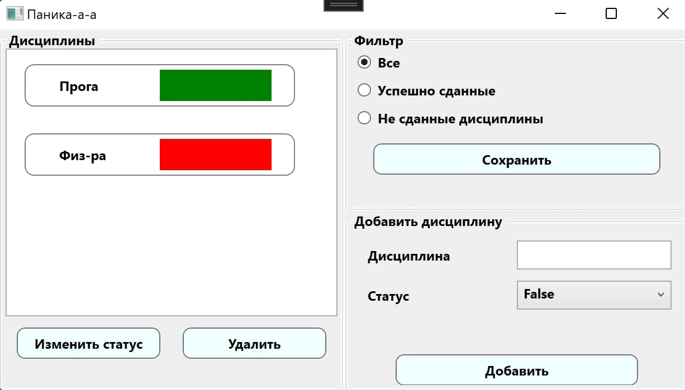
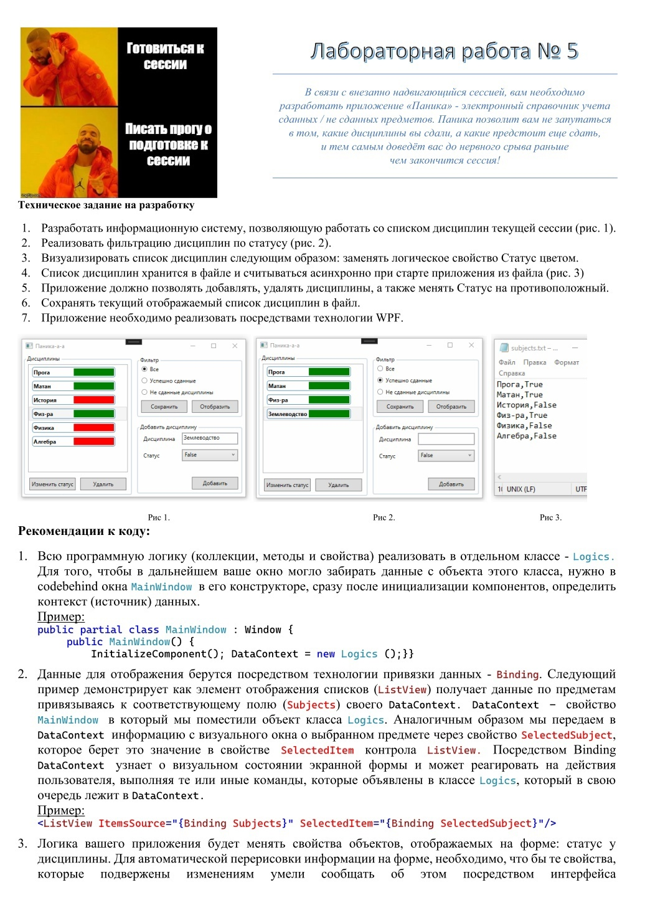
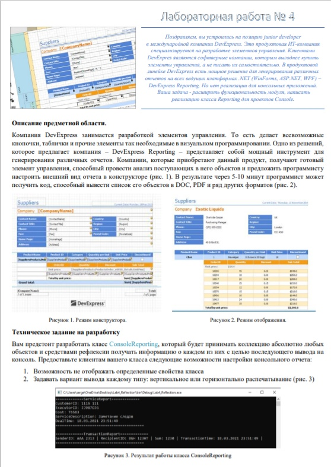
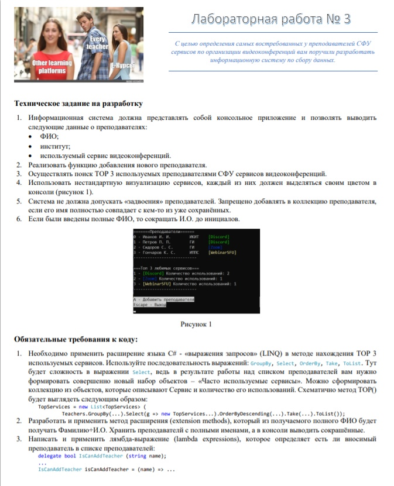
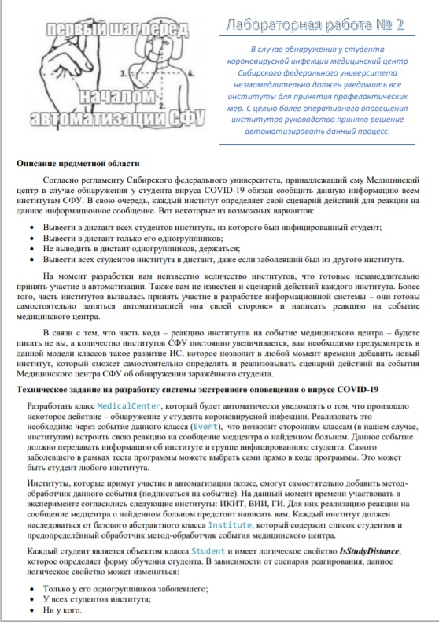
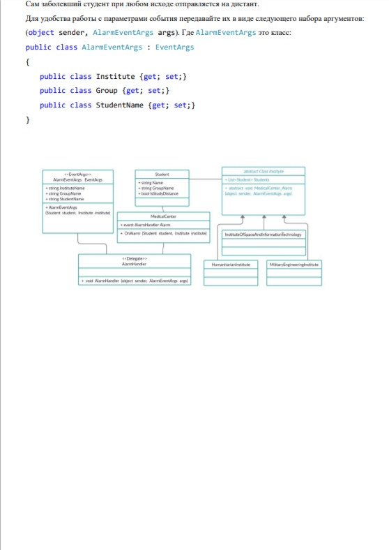
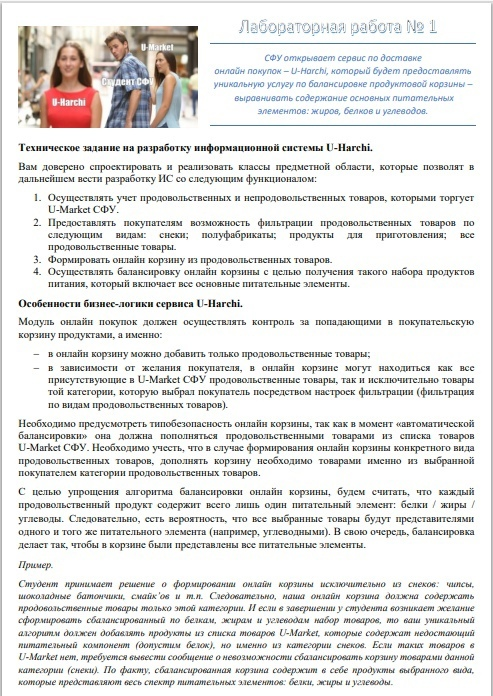
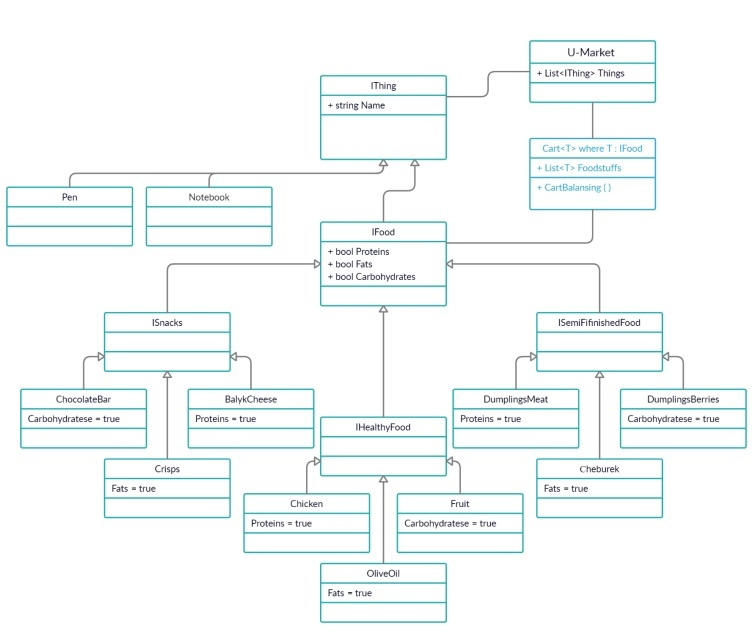

# C# - Лабораторные работы 
# Дисциплина: программирование

## Лабораторная №5
## **[Моя имплементация](https://github.com/daniilboyarinkov/Labworks_2semester/tree/master/LabWork5)**

Затронутые темы:
+ Визуальное программирование
+ Асинхронное програмиирование
+ WPF
+ XAML
+ Фильтрация коллекций
+ Работа с файловой системой

## Лабораторная №4

[//]: # (## **[Моя имплементация]&#40;https://github.com/daniilboyarinkov/labwork-s_2semester/tree/master/labwork-4&#41;**)

Затронутые темы:
+ Рефлексия
+ Аттрибуты

## Лабораторная №3

[//]: # (## **[Моя имплементация]&#40;https://github.com/daniilboyarinkov/labwork-s_2semester/tree/master/labwork-3&#41;**)

Затронутые темы:
+ Методы расширений
+ LINQ
+ Lambda выражения
+ Анонимные методы

## Лабораторная №2 

[//]: # (## **[Моя имплементация]&#40;https://github.com/daniilboyarinkov/labwork-s_2semester/tree/master/labwork-2&#41;**)

Затронутые темы:
+ Делегаты
+ События

## Лабораторная №1  

[//]: # (## **[Моя имплементация]&#40;https://github.com/daniilboyarinkov/labwork-s_2semester/tree/master/labwork-1&#41;**)

Затронутые темы:
+ ООП
+ Наследование, ассоциация: композиция, агрегация
+ Абстрактные классы
+ Интерфейсы
+ Generics
+ Условный алгоритм сортировки

P.S. Я немного отклонился от требуемой реализации и сделал сортировку корзину на лету во время рантайма.

Хотя от нас требовалось захардкодить определенный тип и сортировать относительно него, чтобы а-ля понять как работают Дженерики.

Как по мне, если честно - это плохой пример для этого. У меня всё.
