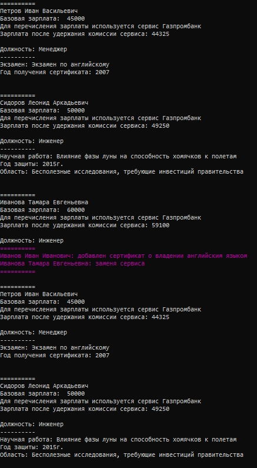
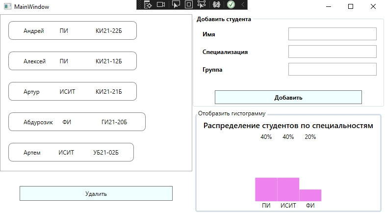
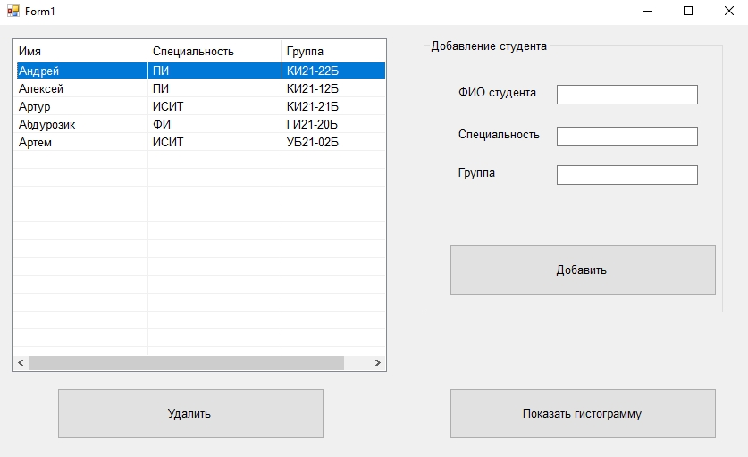
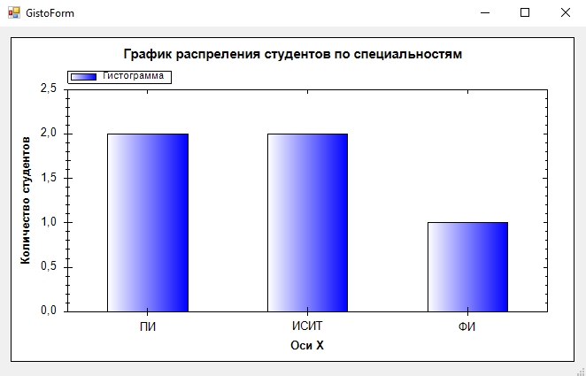
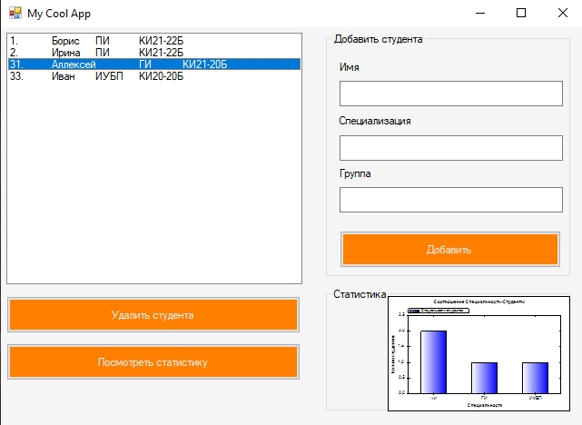
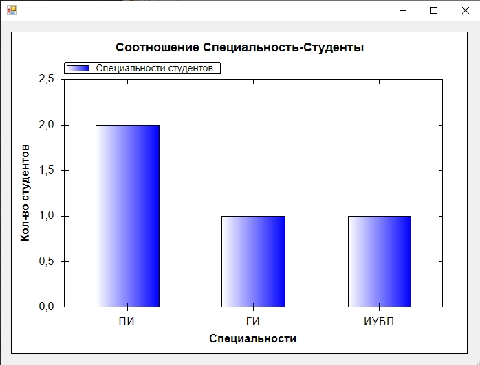
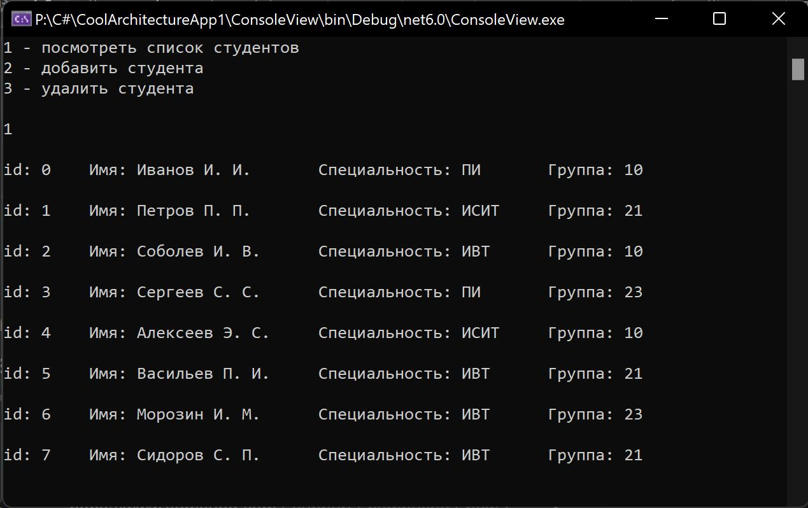
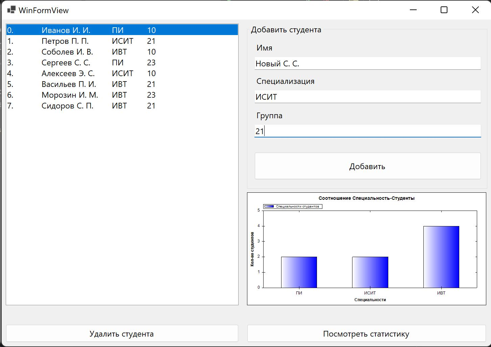
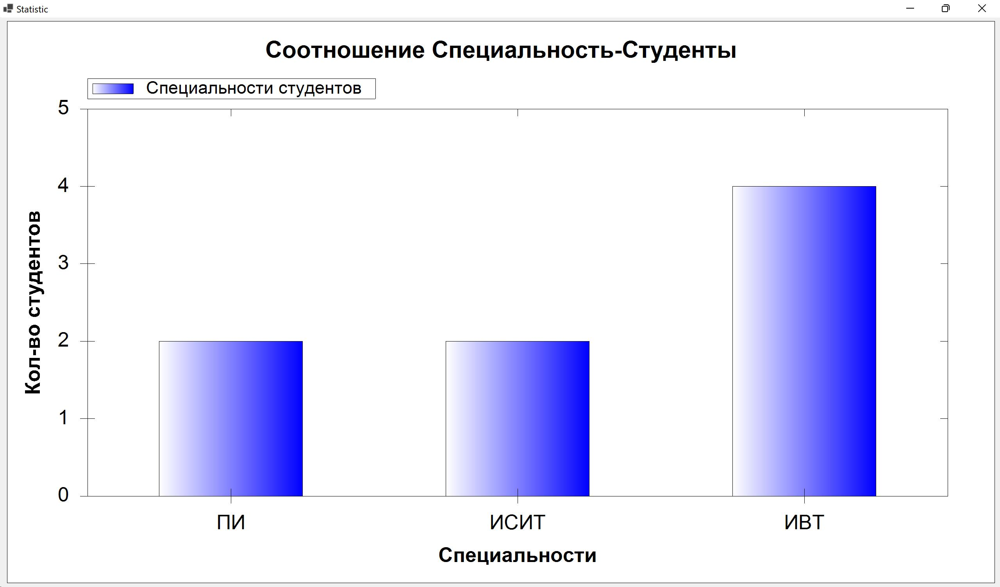

# Лабораторные работы 3 семестр

C#. Архитектура. Паттерны. Лабы.

<!-- ------------------------------------------ -->

## Лабораторная № 6

Прекрасная в реализации лабораторная 

***тык на ссылку***  
[Задание 6 лабораторной](Assets/6.pdf)

+ Структурный паттерн "Декоратор"
+ Поведенченский паттерн "Стратегия"

### Реализация:  

***тык на ссылку***  
[Реализация 6 лабораторной](https://github.com/daniilboyarinkov/labworks-3-semester/tree/6-decorator-strategy-patterns)

### Картиночки:

<!-- ------------------------------------------ -->

## Лабораторная № 5

***тык на ссылку***  
[Задание 5 лабораторной](Assets/5.pdf)

+ MVVM Architecture pattern
+ WPF Technology
+ Слой Модели (Model)
+ Слой представления (View). С разметкой на XAML. О чем ещё можно мечтать в таких условиях.
+ Слой связи модели и редставления (ViewModel). Содержит логику передачи данных из слоя модели в слой представления поредством binding-а, а также логика по обновлению данных в модели

### Реализация:  

***тык на ссылку***  
[Реализация 5 лабораторной](https://github.com/daniilboyarinkov/labworks-3-semester/tree/5-mvvm-pattern)

### Картиночки:

<!-- ------------------------------------------ -->

## Лабораторная № 4

***тык на ссылку***  
[Задание 4 лабораторной](Assets/4.pdf)

+ MVP Architecture pattern
+ Слой Модели (Model)
+ Слой представления (View)
+ Слой "обслуживания" представления (Presenter). По своей сути сопоставляет логику реализованную на уровне модели с имплементируешей событийной привязкой на уровне представления
+ Вспомогательная библиотека для избежания циклических зависимостей в реализации нашего решения (Shared)

### Реализация:  

***тык на ссылку***  
[Реализация 4 лабораторной](https://github.com/daniilboyarinkov/labworks-3-semester/tree/4-mvp-pattern-realisation)

### Картиночки:

**Windows Forms View**

При нажатии кнопки **показать гистограмму** открывается окно со статистической гистограммой

<!-- ------------------------------------------ -->

## Лабораторная № 3

***тык на ссылку***  
[Задание 3 лабораторной](Assets/3.pdf)

+ SingleTon Pattern 
+ Отвязка жесткой привязанности к реализации определенного репозитория (EntityRepository/DapperRepository)
+ Использование Ninject.MVC5 для инверсии зависимостей

### Реализация:

***тык на ссылку***  
[Реализация 3 лабораторной](https://github.com/daniilboyarinkov/labworks-3-semester/tree/3-labwork)

### Картиночки:

**Windows Forms View**

При нажатии кнопки **посмотреть статистику** всплывает окно со статистикой

<!-- ------------------------------------------ -->

## Лабораторная № 2

***тык на ссылку***  
[Задание 2 лабораторной](Assets/2.pdf)

+ MWP паттерн,
+ Подключение Базы Данных к приложению из прошлой лабы
+ Реализация взаимодействия с БД
  + с помощью Entity Framework
  + С помощью Dapper
+ Реализация слоя доступа к данным (DataAccessLayer)

### Реализация:

***тык на ссылку***  
[Реализация 2 лабораторной](https://github.com/daniilboyarinkov/labworks-3-semester/tree/2-mvp-database)

*Картиночек не завезли(*

Вторая лаба be like:  

<!-- ------------------------------------------ -->

## Лабораторная № 1

***тык на ссылку***  
[Задание 1 лабораторной](Assets/1.pdf)

+ MWP паттерн,  
+ dll-библиотека **моделей**,  
+ dll-библиотека **бизнес логики**,  
+ **Views:**  
  - **Консоль**ное представление,
  - **Windows Forms** (почему? чтобы постичь Дзен, идя от основ мироздания)

### Реализация:

***тык на ссылку***  
[Реализация 1 лабораторной](https://github.com/daniilboyarinkov/labworks-3-semester/tree/1-mvp-pattern)

### Картиночки:

Консольное представление **(Console View)**

**Windows Forms View**

При нажатии кнопки **посмотреть статистику** всплывает окно со статистикой

